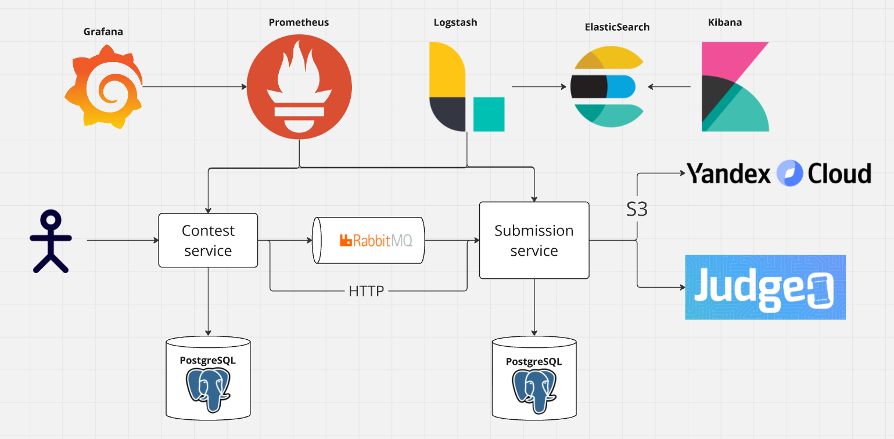
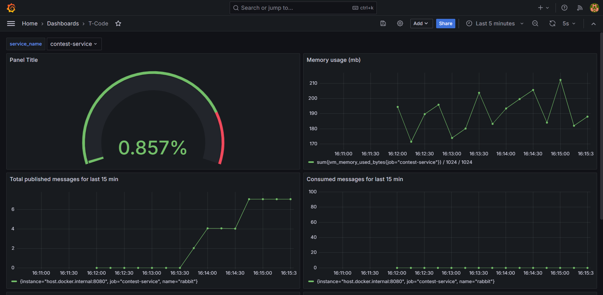
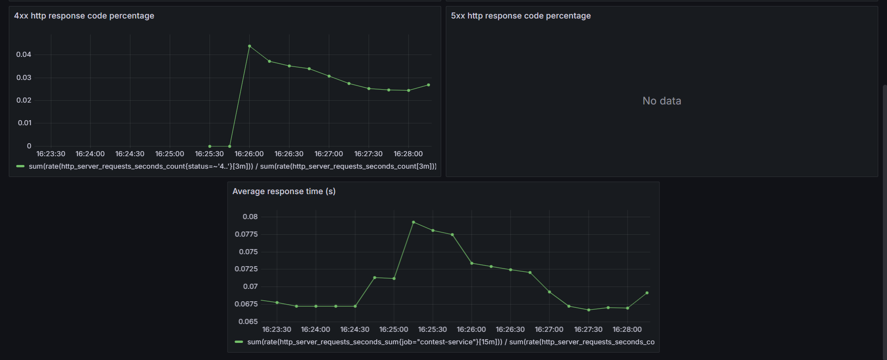
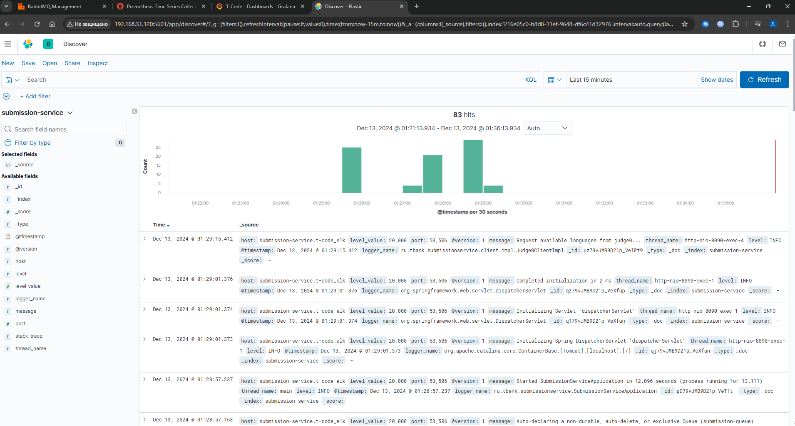
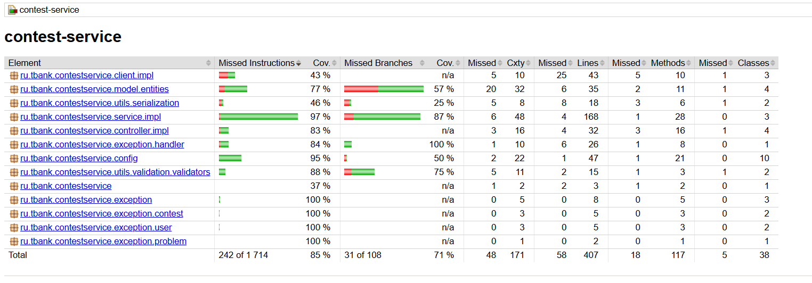
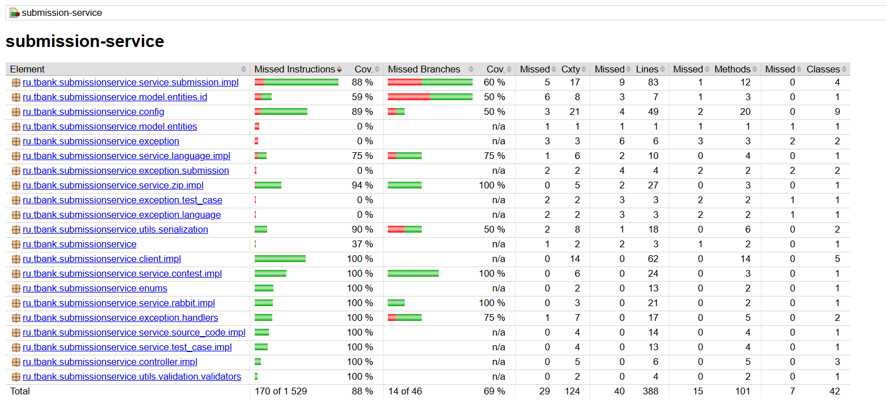

# T-Code

## Описание проекта

T-Code - приложение для решения алгоритмических задач в рамках контестов (соревнований).
Оно позволяет создавать задачи и контесты, а также принимать участие в контестах других пользователей.

## Технологии

### Основные

1. Java 21
2. Spring boot 3
3. Postgres 16
4. Liquibase 4.25
5. RabbitMQ 4.0

### Интеграции

1. [Yandex Cloud Object Storage (S3)](https://yandex.cloud/ru/services/storage)
2. [Judge0](https://github.com/judge0/judge0)

### Метрики

1. Prometheus
2. Grafana

### Логи

1. ElasticSearch
2. Logstash
3. Kibana

### Деплой

1. Docker

### CI\CD

1. GitHub Actions

## Архитектура проекта



## Метрики

В проект добавление Prometheus для сбора метрик и Grafana для их визуализации.

Добавлен дашборд, на котором можно мониторить:

1. Использование процессора
2. Использование памяти процессом
3. Количество созданных и потребленных сообщений через RabbitMQ
4. Доля запросов с http кодами 4xx и 5xx.
5. Среднее время обработки запроса

Конфигурация дашборда (json model) хранится в директории grafana.
С помощью данной конфигурации
можно [импортировать](https://grafana.com/docs/grafana/latest/dashboards/build-dashboards/import-dashboards/) данный
дашборд.
В качестве адреса prometheus data source нужно будет указать `http://prometheus:9090`

#### Дашборд




## Логи

Для сбора логов добавлена конфигурация для поднятия elk стэка в docker compose.
Каждый сервис пишет логи в отдельный index (contest-service или submission-service),
что позволяет просматривать логи каждого сервиса по отдельности.

#### Kibana dashboard



## Тестирование

Код покрыт юнит тестами. Помимо этого добавлены интеграционные тесты с использованием TestContainers (для поднятия
postgresql, rabbitmq и s3 object storage).

### Покрытие тестами:

#### Contest service



#### Submission service



## Запуск проекта

### Требования

1. Установленный докер
2. Сервисный аккаунт в яндекс облаке с ролями `storage.uploader` и `storage.editor`
3. Два созданных бакета - для тест кейсов и для исходного кода пользователей (см конфигурацию ниже).

### Алгоритм

1. Создаем файл `.env` в корне проекта. Добавляем в него переменные окружения, необходимые для приложения (см
   конфигурацию ниже).
2. Исполняем команду `docker compose up` в папке с проектом.

### .env файл

```.dotenv
CONTEST_POSTGRES_HOST=contest_db
CONTEST_POSTGRES_PORT=5432

SUBMISSION_POSTGRES_HOST=submission_db
SUBMISSION_POSTGRES_PORT=5432

RABBIT_MQ_HOST=rabbitmq
RABBITMQ_USERNAME=rmuser
RABBITMQ_PASSWORD=rmpassword

YANDEX_CLOUD_S3_ACCESS_KEY_ID=<YOUR_ACCESS_KEY_ID>
YANDEX_CLOUD_S3_SECRET_ACCESS_KEY=<YOUR_SECRET_ACCESS_KEY>

SUBMISSION_SOURCE_CODE_BUCKET_NAME=submission-source-code
TEST_ARCHIVE_BUCKET_NAME=test-case-archive

SUBMISSION_QUEUE_NAME=submission-queue
SUBMISSION_DEAD_LETTER_QUEUE_NAME=submission-dead-letter-queue

SUBMISSION_SERVICE_BASE_URL=http://submission-service:8090
JUDGE0_API_BASE_URL=http://judge0-server:2358

CONTEST_LOGSTASH_HOST_AND_PORT=logstash:5044
SUBMISSION_LOGSTASH_HOST_AND_PORT=logstash:5045
```