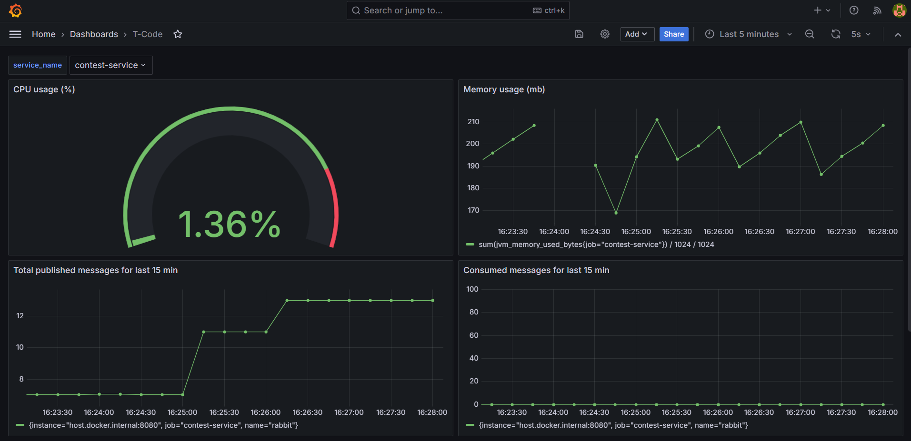

# T-Code

## Описание проекта

T-Code - приложение для решения алгоритмических задач в рамках контестов (соревнований).
Оно позволяет создавать задачи и контесты, а также принимать участие в контестах других пользователей.

## Технологии

1. Java 21
2. Spring boot 3
3. PostgreSQL 16
4. Liquibase 4.25
5. RabbitMQ 4.0
6. Yandex Cloud Object Storage (S3)
7. [Judge0](https://github.com/judge0/judge0)
8. Prometheus
9. Grafana
10. Docker
11. GitHub Actions

## Архитектура проекта

## Observability

В проект добавление Prometheus для сбора метрик и Grafana для их визуализации.

Добавлен дашборд, на котором можно мониторить:

1. Использование процессора
2. Использование памяти процессом
3. Количество созданных и потребленных сообщений через RabbitMQ
4. Доля запросов с http кодами 4xx и 5xx.
5. Среднее время обработки запроса

Конфигурация дашборда (json model) хранится в директории grafana.

#### Дашборд

## Тестирование

Код покрыт юнит тестами. Помимо этого добавлены интеграционные тесты с использованием testcontainers (для поднятия
postgresql, rabbitmq и s3 object storage).

### Покрытие тестами:

#### Contest service

#### Submission service

## Запуск проекта

Указать здесь файл env и перечислить, какие переменные окружения нужно внести
